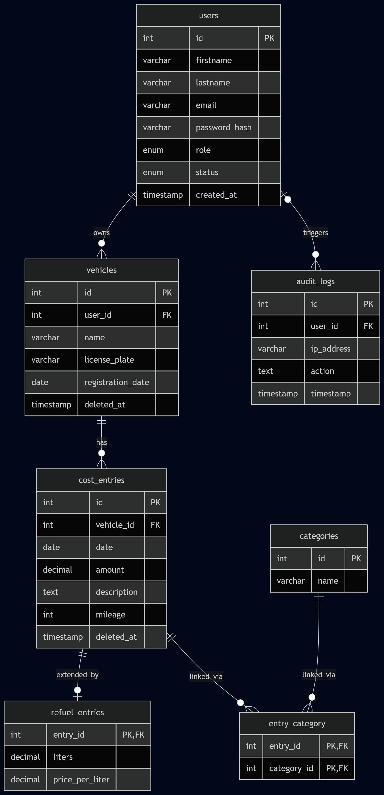

## 1. Architekturübersicht
Die Anwendung basiert auf dem klassischen **Model-View-Controller (MVC)** Architekturmuster.

### 1.1 Front Controller (`index.php`)
Der Front Controller bildet den zentralen Einstiegspunkt (Single Point of Entry) für alle eingehenden HTTP-Anfragen.
* **Routing:** Übernimmt die Analyse der aufgerufenen URLs und ordnet diese über ein definiertes Regelwerk den entsprechenden Controllern zu.
* **Autoloading:** Registriert den **PSR-4 Autoloader** für das automatische, performante Laden von Klassen ohne manuelle `require`-Statements.
* **Session-Initialisierung:** Startet die PHP-Session unter Verwendung restriktiver und sicherer Konfigurationsparameter (siehe Abschnitt 2.2).

### 1.2 Controller (`src/Controllers/`)
Die Controller enthalten die Anwendungs- und Steuerungslogik. Sie fungieren als Bindeglied zwischen Benutzeroberfläche und Datenmodell.
* **Request-Verarbeitung:** Nehmen HTTP-Requests (GET, POST etc.) entgegen und validieren sämtliche Eingabedaten.
* **Modell-Interaktion:** Steuern die Kommunikation mit den entsprechenden Models zur Datenabfrage oder -änderung.
* **View-Rendering:** Entscheiden anhand der Logik, welcher View gerendert und mit welchen Datenvariablen er befüllt wird.
* **Zentrale Basisklasse:** Eine übergreifende Controller-Basisklasse (`BaseController`) kapselt wiederkehrende Aufgaben wie die Überprüfung von Zugriffsrechten (RBAC) und den globalen CSRF-Schutz.

### 1.3 Models (`src/Models/`)
In den Models ist die gesamte Datenzugriffslogik auf die MySQL-Datenbank gekapselt. Sie spiegeln die Geschäftsobjekte der Anwendung wider.
* **Datenbankverbindung:** Alle Models erben von einer gemeinsamen Basisklasse. Diese stellt über das **Singleton-Pattern** eine persistente, ressourcenschonende und wiederverwendbare Datenbankverbindung bereit.
* **Datenoperationen:** In den Models werden alle **CRUD-Operationen** (*Create, Read, Update, Delete*) ausgeführt, spezifische SQL-Queries abgesetzt sowie komplexe Berechnungen (z. B. statistische Auswertungen für das Dashboard) durchgeführt.

### 1.4 Views (`src/Views/`)
Die Views sind ausschließlich für die visuelle Darstellung (Präsentationsschicht) verantwortlich.
* **PHP-Templates:** Die Views sind als saubere PHP-Templates umgesetzt, die primär HTML-Markup enthalten.
* **Dynamische Dateninjektion:** Der Controller injiziert über eine standardisierte `render()`-Methode dynamisch die vorbereiteten Daten. In den Views wird auf Logik verzichtet; es kommen lediglich Kontrollstrukturen zur Datenausgabe zum Einsatz.

---

## 2. Sicherheitsmaßnahmen

Die Architektur integriert moderne Sicherheitsstandards direkt im Kern, um typische Web-Schwachstellen (OWASP Top 10) proaktiv auf technischer Ebene zu verhindern.

### 2.1 Schutz vor SQL-Injections
* **Technologie:** Der gesamte Datenbankzugriff erfolgt konsequent über die **PDO-Erweiterung** (PHP Data Objects).
* **Prepared Statements:** Benutzereingaben werden niemals direkt in SQL-Queries verkettet. Stattdessen werden ausnahmslos *Prepared Statements* mit explizitem Parameter-Binding verwendet. Dies trennt die SQL-Befehlsstruktur strikt von den Benutzerdaten und macht SQL-Injections technisch unmöglich.

### 2.2 Sicheres Session-Management
* **Session-Fixation-Schutz:** Bei jedem erfolgreichen Login oder Rollenwechsel wird die Funktion `session_regenerate_id(true)` aufgerufen. Dadurch wird die alte Session-ID ungültig gemacht und eine neue generiert, was das Stehlen bestehender Sessions erschwert.
* **Cookie-Sicherheit:** Session-Cookies werden serverseitig mit strikten Sicherheits-Flags konfiguriert:
  * `HttpOnly`: Verhindert den Auslese-Zugriff auf das Cookie durch clientseitige Skripte, wodurch Session-Diebstahl via Cross-Site Scripting (XSS) unterbunden wird.
  * `SameSite=Strict`: Schützt vor seitenübergreifenden Anfragen und minimiert das Risiko von CSRF-Angriffen über den Browser-Kontext.
  * `Secure` *(empfohlen im Produktivbetrieb)*: Erlaubt den Cookie-Transfer ausschließlich über verschlüsselte HTTPS-Verbindungen.

### 2.3 Autorisierung via RBAC (Role-Based Access Control)
Das System implementiert ein rollenbasiertes Zugriffskonzept zur feingranularen Absicherung von Ressourcen:
* **Rollenhierarchie:** Es existieren standardmäßig Rollen wie `anonymous` (nicht eingeloggt), `registered` (Standard-Benutzer) und `administrator` (vollständiger Systemzugriff).
* **Controller-Absicherung:** Der Zugriff auf sensible Endpunkte oder administrative Bereiche wird auf Controller-Ebene durch spezifische Methoden wie `requireLogin()` und `requireRole('administrator')` strikt verifiziert. Bei unzureichenden Rechten erfolgt ein Abbruch (HTTP 403) oder eine sichere Weiterleitung.

### 2.4 CSRF-Schutz (Cross-Site Request Forgery)
* **Token-Validierung:** Alle zustandsändernden HTTP-Anfragen (insb. POST-Requests in Formularen) erfordern ein kryptografisch sicheres, einmaliges CSRF-Token.
* **Ablauf:** Das Token wird serverseitig pro Session generiert, in Formularen als verstecktes Feld mitgesendet und in der Basisklasse des Controllers vor der Verarbeitung der Geschäftslogik validiert. Fehlt das Token oder ist es ungültig, wird die Anfrage verworfen.

### 2.5 Passwort-Sicherheit
* **Hashing-Verfahren:** Passwörter werden niemals im Klartext verarbeitet oder gespeichert. Die Anwendung nutzt die native PHP-Funktion `password_hash()`.
* **Algorithmen:** Es werden ausschließlich die stärksten verfügbaren Algorithmen verwendet (**Bcrypt** oder **Argon2**), welche automatisch ein sicheres, individuelles Salt pro Passwort generieren.
* **Verifizierung:** Die Überprüfung beim Login erfolgt zeitkonstant und sicher über die Funktion `password_verify()`.

### 2.6 Audit Logging & Brute-Force-Schutz
* **Audit Log:** Sicherheitsrelevante Ereignisse (z. B. erfolgreiche/fehlgeschlagene Logins, Passwortänderungen, kritische Datenlöschungen) werden über ein dediziertes `AuditLogModel` revisionssicher in der Datenbank protokolliert.
* **Rate Limiting:** Zum Schutz vor Brute-Force-Angriffen überwacht das System die Anzahl fehlschlagender Anmeldeversuche. Nach Überschreiten eines Schwellenwerts (z. B. 15 Fehlversuche) wird die betroffene IP-Adresse oder der Account temporär blockiert (z. B. für 15 Minuten).

---

## 3. Datenbankschema

