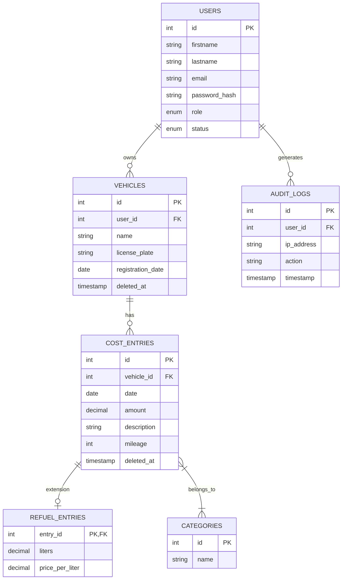

# Projekt-Dokumentation: Fahrzeugkosten-Tracker

## 1. Architektur-Beschreibung
Die Anwendung wurde nach dem **Model-View-Controller (MVC) Muster** in plain PHP (Version >= 8.5) umgesetzt.

- **Routing**: Ein zentraler Einstiegspunkt (`index.php`) verarbeitet alle Anfragen und leitet sie basierend auf dem URL-Pfad an den entsprechenden Controller weiter.
- **Controller**: Befinden sich in `src/Controllers/`. Sie verarbeiten Benutzereingaben, validieren diese (inkl. CSRF-Schutz) und koordinieren die Interaktion zwischen Models und Views.
- **Models**: Befinden sich in `src/Models/`. Sie kapseln die Geschäftslogik und den Datenbankzugriff über PDO mit Prepared Statements.
- **Views**: Befinden sich in `src/Views/`. Es handelt sich um PHP-Templates, die HTML5 und Bootstrap 5 nutzen. Alle dynamischen Ausgaben werden mittels `e()` (htmlspecialchars) escaped.
- **Datenbank**: Eine MariaDB/MySQL Datenbank wird verwendet. Die Verbindung wird über ein Singleton-Pattern in `src/Database.php` verwaltet.

## 2. Datenbank-Design (ER-Diagramm)

## 3. Sicherheitsmaßnahmen
- **SQL-Injection**: Konsequente Verwendung von **PDO Prepared Statements**.
- **XSS (Cross-Site Scripting)**: Sämtliche Benutzerausgaben werden über die Helper-Funktion `e()` mit `htmlspecialchars` gefiltert.
- **CSRF (Cross-Site Request Forgery)**: Alle Formulare nutzen ein zufällig generiertes CSRF-Token, welches serverseitig in der Session validiert wird.
- **Passwort-Sicherheit**: Verwendung von `password_hash()` und `password_verify()` mit dem Standard-Algorithmus (Bcrypt/Argon2).
- **Session-Sicherheit**: HttpOnly-Cookies und SameSite-Attribute zur Absicherung der Session.
- **User-Status**: Bei jedem Login wird geprüft, ob der Account durch einen Administrator deaktiviert wurde.

## 4. Testfälle
Detaillierte Testfälle befinden sich in der Datei `doc/TESTCASES.md`.
